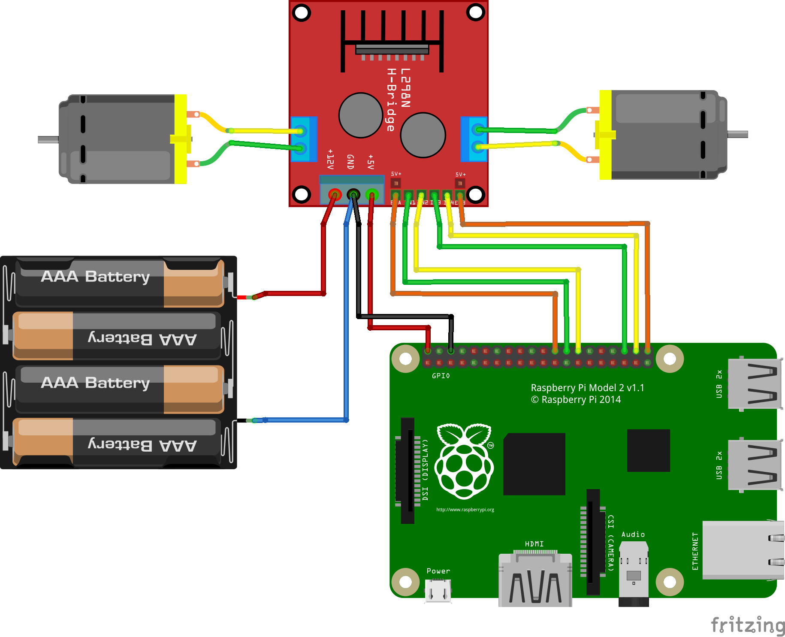

# Drop Robot API

PHP scripts to make a drop robot move and rotate.


## Install

``` bash
git clone git@github.com:Darkmira/drop-robotapi.git
cd drop-robotapi/

# Create your .env from distribution and edit it
cp .env.dist .env

# Using docker on RaspberryPi or x64 PC ?
cp docker/docker-compose.arm.yml docker-compose.override.yml # For RaspberryPi
cp docker/docker-compose.amd.yml docker-compose.override.yml # For x64 PC (for develop and testing purpose)

make
```


## Usage

Just call the script you want among:

- `forward.php`
- `backward.php`
- `left.php`
- `right.php`

Example:

``` bash
./bin/forward.php
# or
php bin/forward.php
```

Or using docker:

``` bash
make bash

./bin/forward.php
```


## Wiring



The pins used on the Raspberry Pi are the one configured in `.env` file.

You may need to change them, or switch left and right motors, and/or `A` and `B` pins,
depending on how you wired motors and L298N controller.


## License

This library is under [MIT License](LICENSE).
